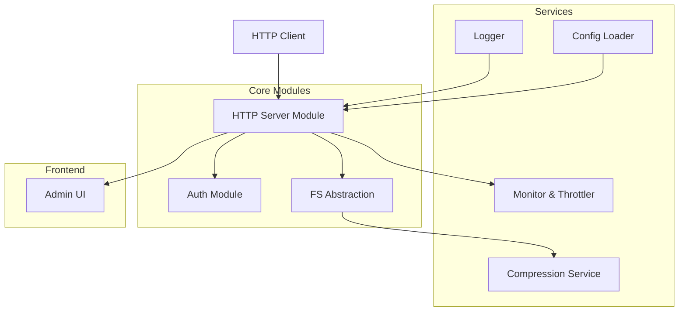

# Piano di Realizzazione (PDR) per HtserveFS

## 1. Panoramica del Progetto

HtserveFS è un file server HTTP scalabile, progettato per essere trasformato in un eseguibile standalone (≤ 5 MB) senza finestre di terminale su Windows. Tramite chiamate HTTP(S) si accede in lettura e scrittura al file system della macchina host.

**Obiettivi principali:**

* Fornire accesso remoto sicuro al file system locale via HTTP/HTTPS

* Garantire un'interfaccia web di amministrazione intuitiva e responsive

* Implementare controlli di sicurezza avanzati e protezione brute-force

* Ottimizzare le performance per operazioni I/O con latenze minime

## 2. Descrizione Generale

HtserveFS espone il file system locale come servizio HTTP/HTTPS, con interfaccia web di amministrazione e controlli di sicurezza. I principali stakeholder sono amministratori di sistema e utenti finali che necessitano di condividere risorse file-based in rete in modo semplice e sicuro.

### 2.1 Obiettivi Funzionali

* **Accesso remoto** a file e cartelle via HTTP/HTTPS

* **Upload/download** con supporto resume (Range requests)

* **Compressione** (zip) on-the-fly di file/cartelle

* **Amministrazione** via interfaccia web (selezione dischi, permessi, utenti)

* **Monitoraggio** connessioni in tempo reale

* **Gestione banda** (bandwidth throttling)

* **Protezione** da attacchi brute-force

### 2.2 Vincoli e Presupposti

* Eseguibile standalone ≤ 5 MB

* Nessuna console/terminale aperto su Windows

* Configurazione esterna (file JSON)

* Futuro supporto a plugin o moduli aggiuntivi

## 3. Requisiti Funzionali

### 3.1 HTTP/HTTPS

* Avvio di server HTTP con configurazione flessibile

* TLS integrato con certificato "ready-to-use"

* Gestione semplificata di certificati personalizzati

### 3.2 Gestione Risorse

* Selezione di dischi, directory e file da esporre

* CRUD sui file via API REST

* Navigazione gerarchica del file system

### 3.3 Autenticazione e Autorizzazione

* Gestione utenti e ruoli (admin, read-only, read-write)

* Password hashing sicuro (bcrypt/argon2)

* Lock-out dopo soglia di tentativi falliti (brute-force protection)

### 3.4 Interfaccia di Amministrazione

* UI responsive e mobile-friendly

* Dashboard con statistiche real-time (connessioni, throughput)

* Gestione configurazioni sistema

### 3.5 File Transfer

* Download/upload con resume (Range requests)

* Throttling configurabile per utente/IP

* Progress tracking e gestione errori

### 3.6 Compressione

* Zip on-the-fly di singoli file o cartelle

* Streaming compression per file di grandi dimensioni

## 4. Requisiti Non Funzionali

* **Performance**: Latenze minime per operazioni I/O

* **Scalabilità**: Architettura modulare per estensioni future

* **Sicurezza**: TLS, brute-force lockout, HTTPS by default

* **Portabilità**: Windows, Linux, macOS (cross-compile)

* **Manutenibilità**: Codice strutturato, log dettagliati

## 5. Scelte Tecnologiche

### 5.1 Linguaggio di Implementazione

Il sistema potrà scegliere tra i seguenti linguaggi:

| Linguaggio | Dimensione Stimata | Note Principali                                   |
| ---------- | ------------------ | ------------------------------------------------- |
| **Rust**   | 1–3 MB             | Memory safety, static linking, windows\_subsystem |
| **Go**     | 2–5 MB             | Facile cross-compile, rich stdlib                 |
| **C++**    | 0.5–2 MB           | Controllo massimo, gestione manuale memoria       |
| **Zig**    | 0.5–1.5 MB         | Toolchain monolitica, ecosistema giovane          |

### 5.2 Packaging e Compilazione

* Strumenti di cross-compile (musl per Linux, windows\_subsystem = "windows" per Windows)

* Strip dei simboli e compressione eseguibile

* CI/CD con Docker per build ripetibili

* Ottimizzazioni di dimensione (-Os, LTO)

## 6. Architettura Proposta



### 6.1 Moduli Principali

* **HTTP Server Module**: Gestione richieste, TLS, routing

* **Auth Module**: Utenti, ruoli, lockout, sessioni

* **FS Abstraction**: Wrapper operazioni file system

* **Admin UI**: Frontend web SPA (React/Vue/Vanilla)

* **Compression Service**: Streaming zip, algoritmi compressione

* **Monitor & Throttler**: Metrica connessioni, limiti banda

* **Config Loader**: Parsing JSON esterno, validazione

* **Logger**: Log su file esterno o syslog

## 7. Configurazione

### 7.1 File config.json

File di configurazione esterno nella cartella di esecuzione:

```json
{
  "server": {
    "port": 8080,
    "host": "0.0.0.0",
    "tls": {
      "enabled": true,
      "cert_file": "cert.pem",
      "key_file": "key.pem",
      "auto_cert": true
    }
  },
  "files": {
    "shares": [
      { "path": "D:/Data", "alias": "Dati", "readonly": false },
      { "path": "/var/log", "alias": "Logs", "readonly": true }
    ],
    "max_file_size": "100MB",
    "allowed_extensions": ["*"]
  },
  "auth": {
    "users": [
      { 
        "username": "admin", 
        "password_hash": "$2b$12$...", 
        "role": "admin" 
      }
    ],
    "lockout_threshold": 5,
    "lockout_duration": "15m",
    "session_timeout": "24h"
  },
  "throttling": {
    "default_kbps": 1024,
    "per_user_limits": {
      "admin": 0,
      "user": 512
    }
  },
  "logging": {
    "level": "info",
    "file": "htservefs.log",
    "max_size": "10MB",
    "rotate": true
  }
}
```

## 8. Sicurezza

### 8.1 Protocolli e Crittografia

* **HTTPS by default** con TLS 1.2+

* Certificato self-signed incluso per test

* Possibilità di importare CA custom

* Perfect Forward Secrecy (PFS)

### 8.2 Autenticazione e Protezione

* Password hashing con bcrypt/argon2

* Brute-force lockout progressivo

* CAPTCHA opzionale dopo tentativi falliti

* Rate limiting per API

### 8.3 Controlli Accesso

* CORS configurabile

* Whitelist/blacklist IP

* Controllo permessi granulare per directory

* Audit log delle operazioni

## 9. Deployment e Manutenzione

### 9.1 Packaging

* **Windows**: MSI installer o ZIP con eseguibile e config

* **Linux**: Docker image lightweight, AppImage, o binary statico

* **macOS**: DMG o Homebrew formula

### 9.2 Distribuzione

* Eseguibile standalone senza dipendenze

* Configurazione via file JSON esterno

* Auto-update mechanism opzionale

* Service/daemon integration

### 9.3 Monitoraggio e Manutenzione

* Health-check endpoint (/health)

* Metrics endpoint per Prometheus

* Log rotation automatica

* Script di backup configurazione

* Aggiornamenti via replace binario + restart service

## 10. Piano di Sviluppo

### Fase 1: Core Infrastructure (Settimane 1-3)

* Setup progetto e toolchain

* HTTP server base con TLS

* Sistema di configurazione JSON

* Logging e monitoring base

### Fase 2: File System Operations (Settimane 4-6)

* API REST per operazioni file

* Upload/download con resume

* Compressione on-the-fly

* Gestione permessi base

### Fase 3: Authentication & Security (Settimane 7-9)

* Sistema autenticazione completo

* Brute-force protection

* Rate limiting e throttling

* Audit logging

### Fase 4: Admin Interface (Settimane 10-12)

* Frontend web responsive

* Dashboard con statistiche

* Gestione utenti e configurazioni

* Mobile optimization

### Fase 5: Optimization & Packaging (Settimane 13-14)

* Ottimizzazione performance

* Riduzione dimensione eseguibile

* Testing cross-platform

* Packaging finale

## 11. Testing e Quality Assurance

### 11.1 Strategia di Testing

* Unit tests per tutti i moduli core

* Integration tests per API REST

* Load testing per performance

* Security testing (penetration testing)

* Cross-platform compatibility testing

### 11.2 Metriche di Qualità

* Code coverage > 80%

* Zero memory leaks

* Response time < 100ms per operazioni base

* Supporto concurrent connections > 1000

* Eseguibile finale < 5MB

### 11.3 CI/CD Pipeline

* Automated testing su commit

* Cross-compilation per tutte le piattaforme

* Security scanning automatico

* Performance regression testing

* Automated release packaging

